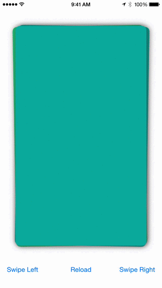

ZLSwipeableView
===============
A simple view for building card like interface like [Tinder](http://www.gotinder.com/) and [Potluck](https://www.potluck.it/).

Preview
---
###Swipe

###Swipe Cancel

###Swipe Programmatically

###Swipe Programmatically II

CocoaPods
---
You can install `ZLSwipeableView` through CocoaPods adding the following to your Podfile:

    pod 'ZLSwipeableView'

Usage
---
Check out the [demo app](https://github.com/zhxnlai/ZLSwipeableView/archive/master.zip) for an example.

`ZLSwipeableView` can be added to storyboard or initialized programmatically:
~~~objective-c
ZLSwipeableView *swipeableView = [[ZLSwipeableView alloc] initWithFrame:self.view.frame];
[self.view addSubview:swipeableView];
~~~

A `ZLSwipeableView` **must** have an object that implements `ZLSwipeableViewDataSource` to act as a data source. `ZLSwipeableView` will prefetch **three** views in advance to animate them.
~~~objective-c
// required data source
self.swipeableView.dataSource = self;

#pragma mark - ZLSwipeableViewDataSource
- (UIView *)nextViewForSwipeableView:(ZLSwipeableView *)swipeableView {
  return [[UIView alloc] init];
}
~~~
A `ZLSwipeableView` can have an optional delegate to receive callback.
~~~objective-c
// optional delegate
self.swipeableView.delegate = self;

#pragma mark - ZLSwipeableViewDelegate
- (void)swipeableView:(ZLSwipeableView *)swipeableView didSwipeLeft:(UIView *)view {
    NSLog(@"did swipe left");
}
- (void)swipeableView:(ZLSwipeableView *)swipeableView didSwipeRight:(UIView *)view {
    NSLog(@"did swipe right");
}
- (void)swipeableView:(ZLSwipeableView *)swipeableView didStartSwipingView:(UIView *)view atLocation:(CGPoint)location {
    NSLog(@"did start swiping at location: x %f, y%f", location.x, location.y);
}
- (void)swipeableView:(ZLSwipeableView *)swipeableView swipingView:(UIView *)view atLocation:(CGPoint)location {
    NSLog(@"swiping at location: x %f, y%f", location.x, location.y);
}
- (void)swipeableView:(ZLSwipeableView *)swipeableView didEndSwipingView:(UIView *)view atLocation:(CGPoint)location {
    NSLog(@"did start swiping at location: x %f, y%f", location.x, location.y);
}
~~~

To swipe the top view programmatically:
~~~objective-c
[self.swipeableView swipeTopViewToLeft];
[self.swipeableView swipeTopViewToRight];
~~~

To discard all views and reload programmatically:
~~~objective-c
[self.swipeableView discardAllSwipeableViews];
[self.swipeableView loadNextSwipeableViewsIfNeeded];
~~~

Requirements
---
- iOS 7 or higher.
- Automatic Reference Counting (ARC).

Contributions
---
- Thanks [iamphill](https://github.com/iamphill) for adding new delegates

License
---
ZLSwipeableView is available under MIT license. See the LICENSE file for more info.
